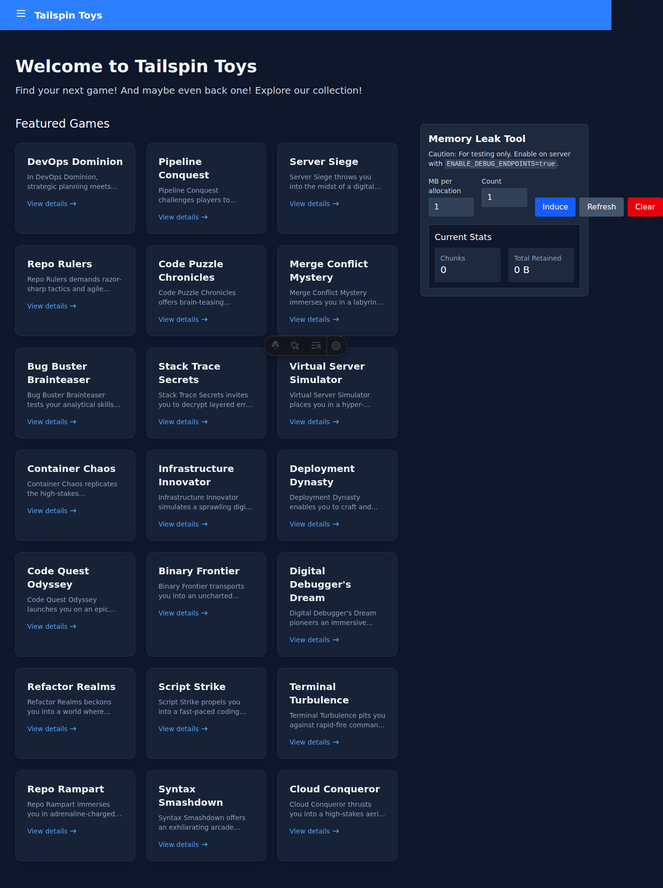
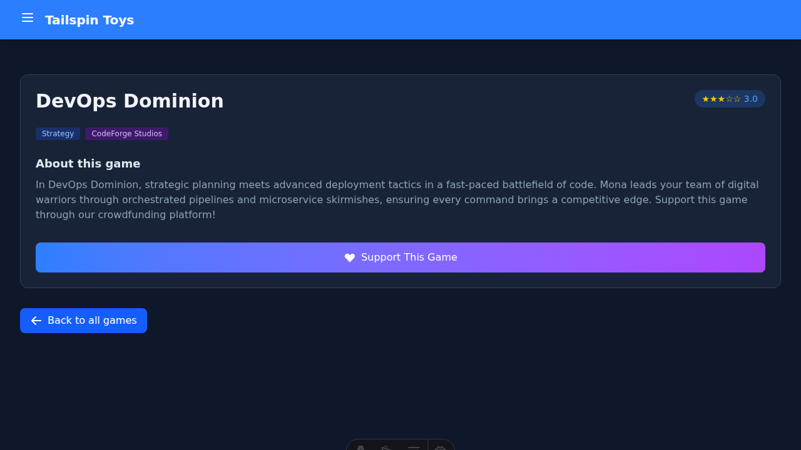

# Tailspin Toys User Guide

Welcome to Tailspin Toys - the premier crowdfunding platform for board games with a developer and DevOps theme! This comprehensive guide will help you navigate and make the most of the platform.

## Table of Contents

1. [Overview](#overview)
2. [Getting Started](#getting-started)
3. [User Features](#user-features)
4. [Developer Information](#developer-information)
5. [Troubleshooting](#troubleshooting)
6. [FAQ](#faq)

## Overview

Tailspin Toys is a specialized crowdfunding platform that brings board games with development and DevOps themes to life. Whether you're a seasoned developer, a tabletop enthusiast, or someone curious about tech-themed games, our platform offers unique gaming experiences that blend the collaborative spirit of software development with engaging gameplay.

### What Makes Tailspin Toys Special

- **Developer-Themed Games**: Explore games featuring continuous integration, agile planning, container orchestration, incident response, and more
- **Community-Driven**: Join forums, share house rules, vote on art directions, and fund expansion modules
- **High-Quality Components**: Professional manufacturing and fulfillment handling
- **Creator Support**: Tools for community feedback, stretch-goal planning, and beta-play sessions

## Getting Started

### System Requirements

To run Tailspin Toys locally for development or testing:

- **Backend**: Python 3.8+, Flask, SQLAlchemy
- **Frontend**: Node.js 18+, Astro, Svelte
- **Database**: SQLite (included)

### Quick Start (For Users)

1. **Access the Platform**: Navigate to the Tailspin Toys website
2. **Browse Games**: Explore featured games on the homepage
3. **View Game Details**: Click on any game to see detailed information
4. **Learn More**: Visit the About page to understand our mission

### Development Setup

If you want to run the application locally:

```bash
# Clone the repository
git clone https://github.com/octodemo/tailspin-application.git
cd tailspin-application

# Run the application
./scripts/start-app.sh
```

The script will:
- Install Python dependencies
- Install Node.js dependencies  
- Start the Flask backend server (http://localhost:5100)
- Start the Astro frontend server (http://localhost:4321)

## User Features

### 1. Homepage - Game Discovery



The homepage is your gateway to discovering exciting developer-themed board games.

**Features:**
- **Featured Games Grid**: Browse through curated selection of games
- **Game Cards**: Each card shows:
  - Game title and description
  - Brief gameplay overview
  - "View details" link for more information
- **Memory Leak Tool**: Development testing tool (visible when debug mode is enabled)

**How to Use:**
1. Scroll through the featured games section
2. Read game descriptions to find games that interest you
3. Click "View details" on any game card to learn more

### 2. Game Details Page



Get comprehensive information about each game before backing it.

**Features:**
- **Game Title & Rating**: See the game name and community star rating
- **Category & Publisher**: Understand the game type and who created it
- **Detailed Description**: In-depth explanation of gameplay and themes
- **Support Button**: Express interest in backing the game
- **Navigation**: Easy return to the main game listing

**Game Categories Include:**
- **Strategy Games**: Tactical gameplay with DevOps themes
- **Puzzle Games**: Logic challenges inspired by coding problems
- **Action Games**: Fast-paced coding battlegrounds
- **Adventure Games**: Epic journeys through digital realms

**Publishers Featured:**
- CodeForge Studios
- DevMasters Inc.
- GitHub Games
- Syntax Studios
- And many more!

### 3. About Page

Learn about Tailspin Toys' mission and values.

**What You'll Find:**
- Company background and philosophy
- How the platform supports game creators
- Community features and engagement opportunities
- Manufacturing and fulfillment information

### 4. Navigation

**Main Navigation:**
- **Tailspin Toys Logo**: Click to return to homepage from any page
- **Back to Games**: Return to main listing from detail pages
- **About**: Learn more about the platform

## Developer Information

### Architecture Overview

Tailspin Toys uses a modern web architecture:

**Backend (Flask):**
- Python Flask web framework
- SQLAlchemy ORM for database operations
- RESTful API design
- SQLite database for simplicity

**Frontend (Astro + Svelte):**
- Astro for static site generation and routing
- Svelte for interactive components
- Tailwind CSS for styling
- Dark theme throughout

### API Endpoints

#### Games API

**Get All Games**
```
GET /api/games
```

Returns an array of all games with their details:

```json
[
  {
    "id": 1,
    "title": "DevOps Dominion",
    "description": "Strategic planning meets advanced deployment tactics...",
    "starRating": 3.0,
    "category": {
      "id": 1,
      "name": "Strategy"
    },
    "publisher": {
      "id": 1,
      "name": "CodeForge Studios"
    }
  }
]
```

**Get Single Game**
```
GET /api/games/{id}
```

Returns detailed information for a specific game by ID.

### Database Models

**Game Model:**
- `id`: Primary key
- `title`: Game name (required, 2+ characters)
- `description`: Game description (required, 10+ characters)
- `star_rating`: Community rating (float)
- `category_id`: Foreign key to Category
- `publisher_id`: Foreign key to Publisher

**Category Model:**
- `id`: Primary key
- `name`: Category name (unique, 2+ characters)
- `description`: Category description (optional, 10+ characters)

**Publisher Model:**
- `id`: Primary key
- `name`: Publisher name (unique, 2+ characters)
- `description`: Publisher description (optional, 10+ characters)

### Development Tools

**Scripts Available:**
- `scripts/start-app.sh`: Launch both backend and frontend servers
- `scripts/setup-env.sh`: Install all dependencies
- `scripts/run-server-tests.sh`: Run Python unit tests

**Debug Features:**
- Memory Leak Tool: Test server memory usage (enable with `ENABLE_DEBUG_ENDPOINTS=true`)
- Flask Debug Mode: Automatic reloading during development
- Vite Hot Reload: Frontend changes update instantly

### Code Style Guidelines

**Python (Backend):**
- Use type hints for all functions
- Follow SQLAlchemy best practices
- Use Flask blueprints for route organization
- Include unit tests for all endpoints

**Frontend:**
- Use Svelte for interactive components
- Follow Astro patterns for static content
- Use Tailwind CSS for styling
- Maintain dark mode theme

## Troubleshooting

### Common Issues

**1. Application Won't Start**

If `./scripts/start-app.sh` fails:

- Check Python version: `python3 --version` (need 3.8+)
- Check Node.js version: `node --version` (need 18+)
- Ensure you're in the project root directory
- Check for error messages in the console output

**2. Games Not Loading**

If the homepage shows loading indefinitely:

- Verify the Flask server is running on port 5100
- Check browser console for JavaScript errors
- Ensure API endpoints are accessible: `curl http://localhost:5100/api/games`

**3. Database Issues**

If you encounter database errors:

- Check if `data/` directory exists
- Verify SQLite file permissions
- Look for migration errors in server logs

**4. Frontend Build Errors**

If the Astro frontend fails to build:

- Clear node_modules: `rm -rf client/node_modules && cd client && npm install`
- Check for TypeScript errors
- Verify all dependencies are installed

### Getting Help

**For Users:**
- Check this user guide first
- Look for known issues in the project repository
- Open an issue on GitHub for bug reports

**For Developers:**
- Review the codebase in `/server` and `/client` directories
- Check existing tests in `/server/tests`
- Follow the development guidelines in `.github/copilot-instructions.md`

## FAQ

**Q: What makes these games special?**
A: Our games uniquely blend software development concepts with engaging tabletop gameplay, making them perfect for developer communities and anyone interested in tech themes.

**Q: Can I suggest new games for the platform?**
A: Yes! We welcome community input and creator submissions. Check our contribution guidelines for more information.

**Q: Are the games suitable for non-developers?**
A: Absolutely! While the themes are developer-inspired, the games are designed to be enjoyable for anyone who appreciates strategic thinking and collaborative gameplay.

**Q: How do I back a game?**
A: Currently, the platform showcases games and allows you to express interest. The full crowdfunding functionality will be implemented in future updates.

**Q: Can I contribute to the platform's development?**
A: Yes! This is an open-source project. Check the repository for contribution guidelines and current development needs.

**Q: What's the Memory Leak Tool for?**
A: This is a development testing feature used to simulate memory usage scenarios. It's only visible when debug mode is enabled and is not intended for regular users.

---

**Need More Help?**

- 📖 Check the main [README.md](README.md) for technical setup
- 🏗️ View [docs/README.md](docs/README.md) for workshop materials  
- 🐛 Report issues on our [GitHub repository](https://github.com/octodemo/tailspin-application)
- 💬 Join our community discussions

Welcome to the exciting world of developer-themed board games at Tailspin Toys!